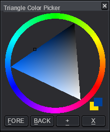
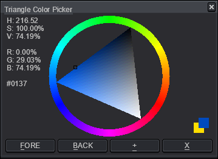

# Aseprite Triangle Color Picker

This is a triangle color picker made with the [Aseprite](https://www.aseprite.org/) [scripting API](https://www.aseprite.org/docs/scripting/). It is intended for use with Aseprite version 1.3 or newer.

## Download

To download this script, click on the green Code button above, then select Download Zip. You can also click on the `aseTriPicker.lua` file. Beware that some browsers will append a `.txt` file format extension to script files on download. Aseprite will not recognize the script until this is removed and the original `.lua` extension is used. There can also be issues with copying and pasting. Be sure to click on the Raw file button; do not copy the formatted code.

## Usage

To use this script, open Aseprite. In the menu bar, go to `File > Scripts > Open Scripts Folder`. Move the Lua script into the folder that opens. Return to Aseprite; go to `File > Scripts > Rescan Scripts Folder` (the default hotkey is `F5`). The script should now be listed under `File > Scripts`. Select `aseTriPicker.lua` to launch the dialog.

If an error message in Aseprite's console appears, check if the script folder is on a file path that includes characters beyond [UTF-8](https://en.wikipedia.org/wiki/UTF-8), such as 'é' (e acute) or 'ö' (o umlaut).

A hot key can be assigned to the script by going to `Edit > Keyboard Shortcuts`. The search input box in the top left of the shortcuts dialog can be used to locate the script by its file name. The dialog can be closed with `Alt+X`. The foreground color can be retrieved with `Alt+F`; the background color, with `Alt+B`.

When the canvas has focus, left click will change the foreground color and right click will adjust the background color. Clicking on the swatches in the bottom-left corner will swap the fore and background color.

When the picker is wider than it is high, it will show text information about the color. Hue is expressed in degrees; other color data is expressed in percentages.

When a color is changed using the outer ring, the Aseprite color will be updated using HSV. When it is changed using the inner triangle, the Aseprite color will be updated using RGB.

In HSV, when a color's saturation is zero, its hue is undefined. When it's value is zero, both its hue and its saturation are undefined. This is easier to understand by visualizing the HSV model as an upside-down cone. If you have both the color picker dialog and the built-in Color Tint/Shade/Tone picker open, you will see the impact of these edge cases. The tint will return to red when a gray color is selected, as undefined hue defaults to zero, which is red.

Ultimately, the [HSV](https://en.wikipedia.org/wiki/HSL_and_HSV) method for representing color is **deeply** flawed. Neither this color picker, nor HSV in general, should be used to create harmonious colors or determine shades of a hue. I would encourage readers to research alternatives like [CIE LAB](https://en.wikipedia.org/wiki/CIELAB_color_space), [SRLAB2](https://www.magnetkern.de/srlab2.html), [OK LAB](https://bottosson.github.io/posts/oklab/), [HSLuv](https://www.hsluv.org/) or [Okhsl](https://bottosson.github.io/posts/colorpicker/).

## Modification

To modify these scripts, see Aseprite's [API Reference](https://github.com/aseprite/api). There is also a [type definition](https://github.com/behreajj/aseprite-type-definition) for use with VS Code and the [Lua Language Server extension](https://github.com/LuaLS/lua-language-server).

## Issues

This script was tested in Aseprite version 1.3.2 on Windows 10. Its user interface elements were tested with 100% screen scaling and 200% UI scaling. Please report issues in the issues section on Github.